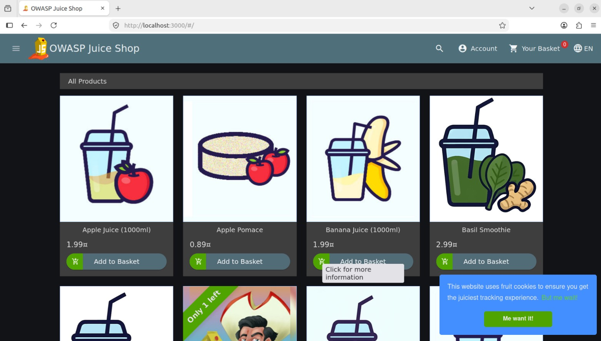
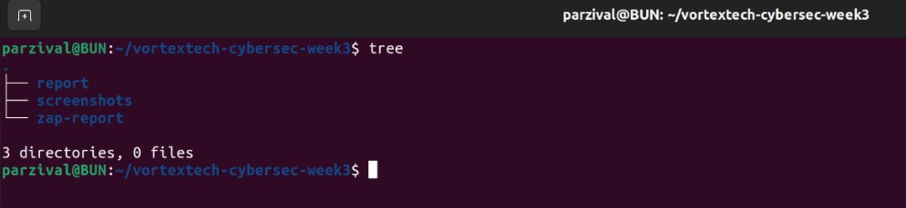
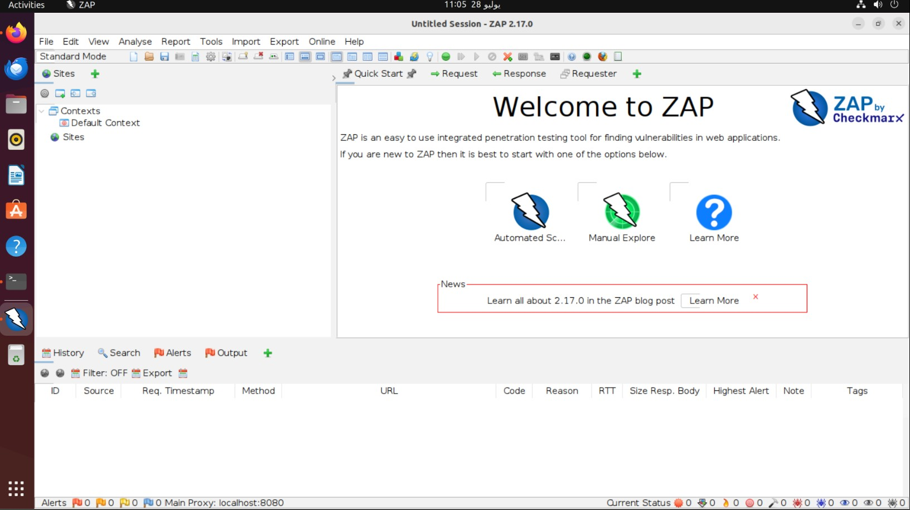
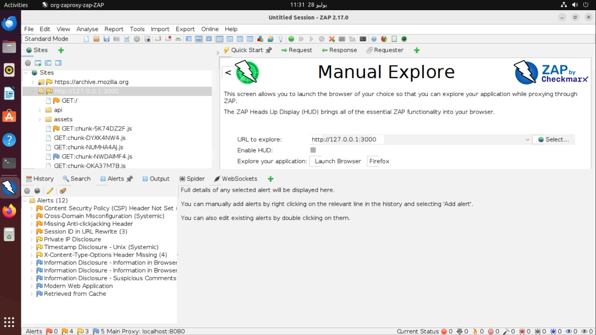
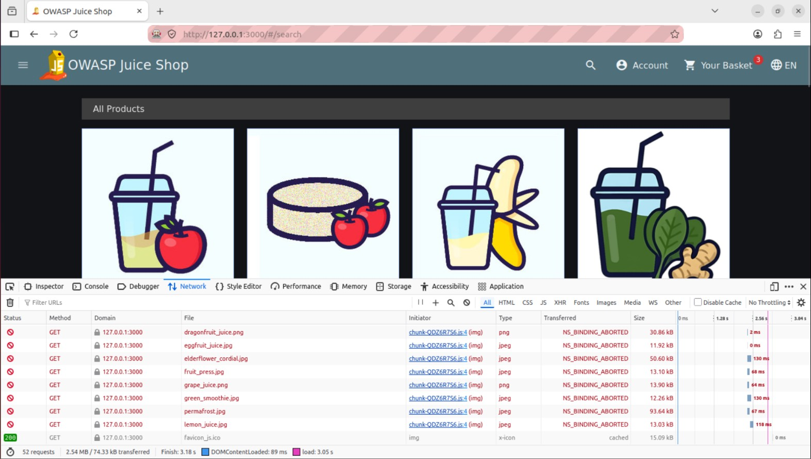
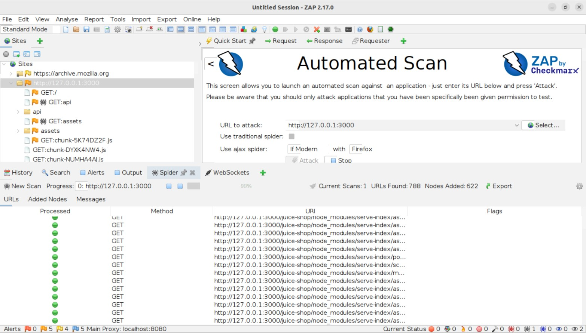
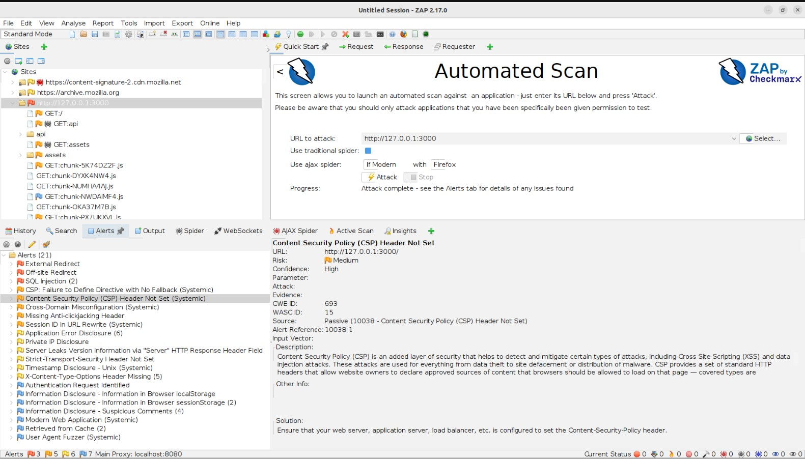
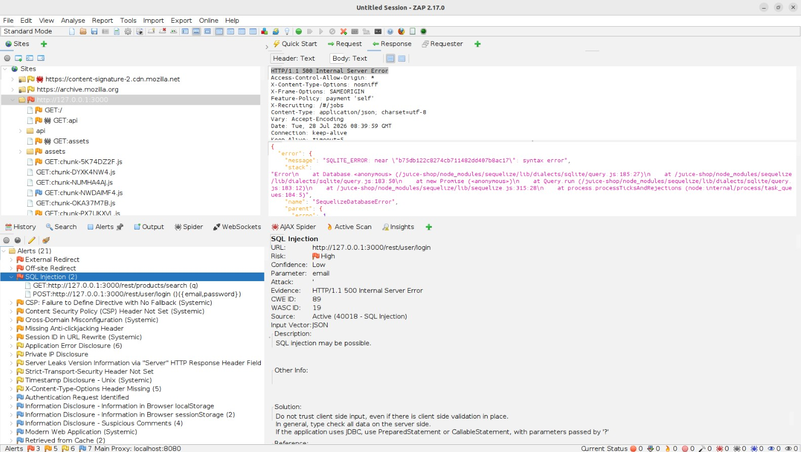
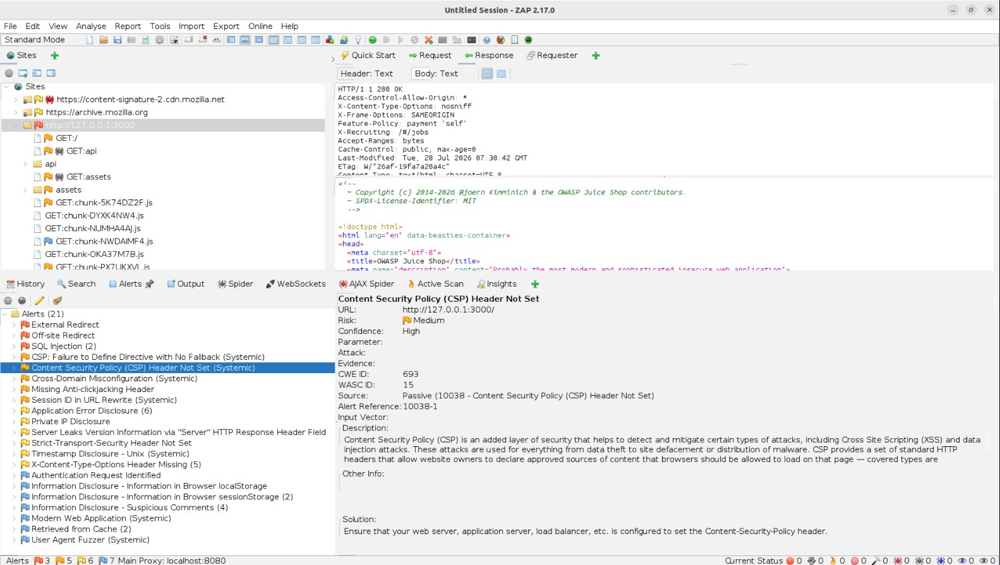
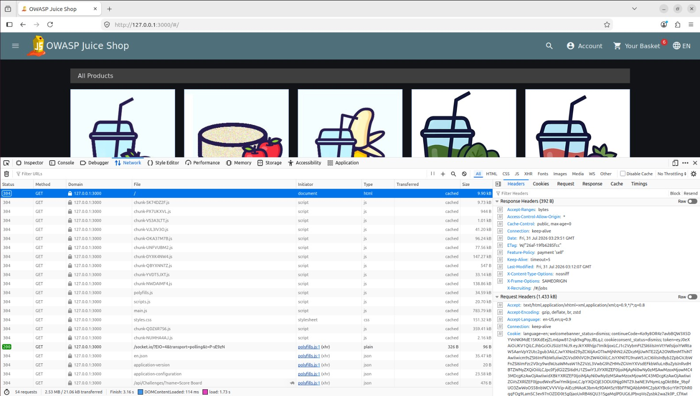

# VortexTech Cybersecurity Week 3 Report

## Basic Security Audit of OWASP Juice Shop

**Name:** Abdullah Zubair  
**Target Application:** OWASP Juice Shop  
**Testing Environment:** Ubuntu Virtual Machine safe lab environment with Docker container  
**Target URL:** `http://127.0.0.1:3000` / `http://localhost:3000`

---

## Table of Contents

1. [Project Overview](#1-project-overview)
2. [Scope](#2-scope)
3. [Ethical Caution](#3-ethical-caution)
4. [Tools Used](#4-tools-used)
5. [Important Setup Notes](#5-important-setup-notes)
6. [Installing Docker on Ubuntu](#6-installing-docker-on-ubuntu)
7. [Running OWASP Juice Shop with Docker](#7-running-owasp-juice-shop-with-docker)
8. [Removing Snap Firefox and Installing Regular Firefox](#8-removing-snap-firefox-and-installing-regular-firefox)
9. [Installing OWASP ZAP Correctly](#9-installing-owasp-zap-correctly)
10. [Methodology](#10-methodology)
11. [Screenshot Evidence](#11-screenshot-evidence)
12. [Findings Summary](#12-findings-summary)
13. [Finding Details](#13-finding-details)
14. [Repository Structure](#14-repository-structure)
15. [Conclusion](#15-conclusion)
16. [Disclaimer](#16-disclaimer)

---

## 1. Project Overview

This repository contains my Week 3 cybersecurity internship task for the VortexTech Internship Program.

The task was to perform a beginner-level security audit on a legal vulnerable-by-design practice website. For this report, I used **OWASP Juice Shop**, which is intentionally vulnerable and designed for web application security training.

The audit focused on identifying, documenting, and manually verifying three vulnerability categories:

1. SQL Injection
2. Application Error Disclosure
3. Missing Content Security Policy Header

---

## Security Audit Report

You can view the complete security audit report here:

📄 [Vortex Week 3 Security Audit Report (PDF)](report/Vortex%20Week%203.pdf)

🛡️ **OWASP ZAP Security Report:**  
You can view the complete live ZAP scan report here:

[🔗 View ZAP Report](https://avatarparzival.github.io/owasp-juice-shop-security-audit/)

---

## 2. Scope

This security audit was performed only against a local instance of OWASP Juice Shop running inside an Ubuntu virtual machine.

No real production website or third-party system was tested.

### In-scope target

```text
OWASP Juice Shop: http://127.0.0.1:3000
```

### Out of scope

```text
Any real public/production website
Any system without explicit permission
```

---

## 3. Ethical Caution

This project was performed only in a private, controlled, legal lab environment using OWASP Juice Shop, which is intentionally vulnerable for training.

**Important:** Do not run scans, attacks, payloads, or vulnerability tests against public websites, production systems, or any system that you do not own or do not have explicit written permission to test. Security testing must always be done only on private servers, local labs, authorized practice targets, or systems where permission has been granted.

---

## 4. Tools Used

- Ubuntu Virtual Machine
- Docker
- OWASP Juice Shop
- OWASP ZAP
- Firefox Browser
- Browser Developer Tools

---

## 5. Important Setup Notes

During setup, I used an Ubuntu VM as a safe and isolated lab environment. I also found that some default Ubuntu packages can cause issues with OWASP ZAP, especially the Snap version of Firefox.

### Important notes

- Use an **Ubuntu or Another Virtual Machine** for safe testing.
- Install **OWASP ZAP using the official ZAP installer**, not the Snap version.
- Remove the **Snap Firefox** version and install the regular Mozilla Firefox package because Snap Firefox may not work properly with ZAP proxy/browser integration.

---

## 6. Installing Docker on Ubuntu

Update the package list:

```bash
sudo apt update
```

Install required packages:

```bash
sudo apt install ca-certificates curl gnupg -y
```

Create the Docker keyrings directory:

```bash
sudo install -m 0755 -d /etc/apt/keyrings
```

Add Docker's official GPG key:

```bash
curl -fsSL https://download.docker.com/linux/ubuntu/gpg | sudo gpg --dearmor -o /etc/apt/keyrings/docker.gpg
```

Set correct permissions:

```bash
sudo chmod a+r /etc/apt/keyrings/docker.gpg
```

Add the Docker repository:

```bash
echo \
  "deb [arch=$(dpkg --print-architecture) signed-by=/etc/apt/keyrings/docker.gpg] https://download.docker.com/linux/ubuntu \
  $(. /etc/os-release && echo "$VERSION_CODENAME") stable" | \
  sudo tee /etc/apt/sources.list.d/docker.list > /dev/null
```

Update packages again:

```bash
sudo apt update
```

Install Docker:

```bash
sudo apt install docker-ce docker-ce-cli containerd.io docker-buildx-plugin docker-compose-plugin -y
```

Verify Docker installation:

```bash
sudo docker --version
```

---

## 7. Running OWASP Juice Shop with Docker

Pull the Juice Shop Docker image:

```bash
sudo docker pull bkimminich/juice-shop
```

Run Juice Shop locally on port `3000`:

```bash
sudo docker run -d -p 3000:3000 --name juice-shop bkimminich/juice-shop
```

Verify that the container is running:

```bash
sudo docker ps
```

Open Juice Shop in the browser:

```text
http://localhost:3000/#/
```

or:

```text
http://127.0.0.1:3000/#/
```

---

## 8. Removing Snap Firefox and Installing Regular Firefox

The Snap version of Firefox may not work correctly with OWASP ZAP because of Snap sandbox restrictions. For ZAP testing, I used the regular Firefox package instead.

Remove Snap Firefox:

```bash
sudo snap remove firefox
```

Add the Mozilla Team PPA:

```bash
sudo add-apt-repository ppa:mozillateam/ppa -y
```

Update the package list:

```bash
sudo apt update
```

Create an APT preference file so Ubuntu prefers the PPA version instead of Snap:

```bash
echo '
Package: firefox*
Pin: release o=LP-PPA-mozillateam
Pin-Priority: 1001

Package: firefox*
Pin: release o=Ubuntu
Pin-Priority: -1
' | sudo tee /etc/apt/preferences.d/mozilla-firefox
```

Install Firefox:

```bash
sudo apt install firefox -y
```

Verify Firefox installation:

```bash
firefox --version
```

---

## 9. Installing OWASP ZAP Correctly

Always install OWASP ZAP using the **official ZAP installer** from the OWASP ZAP website:

```text
https://www.zaproxy.org/download/
```

Do **not** install ZAP using Snap, because the Snap version can cause browser/proxy integration issues.

Recommended approach:

1. Download the Linux installer from the official ZAP website.
2. Make the installer executable.
3. Run the installer.
4. Start ZAP from the installed application.

Example:

```bash
chmod +x ZAP_*.sh
./ZAP_*.sh
```

---

## 10. Methodology

The audit followed these steps:

1. Set up OWASP Juice Shop locally using Docker.
2. Access Juice Shop through Firefox inside the Ubuntu VM.
3. Start OWASP ZAP using the official installed version.
4. Use ZAP Manual Explore to connect to the target.
5. Inspect browser requests and responses using Firefox Developer Tools.
6. Run an automated ZAP scan against `http://127.0.0.1:3000`.
7. Manually verify the selected findings.
8. Document impact, evidence, and remediation steps.

---

## 11. Screenshot Evidence
Screenshot purpose:

| Screenshot | Purpose |
|---|---|
|  | Shows Juice Shop Docker container running in Ubuntu VM |
|  | Shows Juice Shop accessible locally in browser |
|  | Shows repository folder structure |
|  | Shows OWASP ZAP started |
|  | Shows ZAP Manual Explore connected to Juice Shop |
|  | Shows Firefox Developer Tools Network tab |
|  | Shows ZAP automated scan running |
|  | Shows ZAP alerts overview |
|  | Evidence for SQL Injection finding |
|  | Evidence for CSP Header Not Set finding |
|  | Evidence for Application Error Disclosure |
|  | Evidence for Missing Content Security Policy |
|  | Evidence of successful SQL injection test in Juice Shop |


---

## 12. Findings Summary

| # | Finding | Category | Risk |
|---|---|---|---|
| 1 | SQL Injection | Injection | High |
| 2 | Application Error Disclosure | Information Disclosure | Low/Medium |
| 3 | CSP Header Not Set | Security Misconfiguration | Medium |

---

## 13. Finding Details

### Finding 1: SQL Injection

**Category:** Injection / SQL Injection  
**Risk Level:** High  
**Affected Endpoint:** `http://127.0.0.1:3000/rest/user/login`

OWASP ZAP detected a SQL Injection vulnerability in the login endpoint. I also manually verified this vulnerability by using an SQL injection payload in the login form.

Payload used:

```text
' OR true--
```

The application accepted the malicious SQL-style input and allowed authentication bypass into the administrator account:

```text
admin@juice-sh.op
```

**Impact:**  
An attacker could bypass authentication and gain unauthorized access to user or administrator accounts.

**Remediation:**  
Use parameterized queries or prepared statements, validate and sanitize input, avoid SQL query concatenation, and apply server-side validation.

---

### Finding 2: Application Error Disclosure

**Category:** Information Disclosure  
**Risk Level:** Low / Medium  
**Affected Endpoints:** `http://127.0.0.1:3000/api` and unexpected API paths such as `http://127.0.0.1:3000/rest/user/login`

The application disclosed detailed internal error information when unexpected or invalid paths were accessed. The error page exposed Express framework information, internal file paths, and stack trace details.

Example exposed information:

```text
OWASP Juice Shop (Express ^4.22.1)
500 Error: Unexpected path: /rest/user/login
juice-shop/build/routes/angular.js
node_modules/express/lib/router
Layer.handle
trim_prefix
```

**Impact:**  
Detailed error messages can help attackers understand backend technologies, internal structure, and route behavior.

**Remediation:**  
Disable detailed error pages in production, return generic user-facing errors, and log detailed stack traces securely on the server side only.

---

### Finding 3: Content Security Policy Header Not Set

**Category:** Security Misconfiguration  
**Risk Level:** Medium  
**Affected Endpoint:** `http://127.0.0.1:3000/`

The application did not include a `Content-Security-Policy` header in the HTTP response. OWASP ZAP detected this issue as **Content Security Policy Header Not Set**.

**Impact:**  
Without a CSP, the browser has fewer restrictions on which scripts, styles, frames, images, and other resources can be loaded. If an XSS vulnerability exists, the missing CSP can increase the impact of exploitation.

**Remediation:**  
Define and enforce a restrictive Content Security Policy.

Example CSP header:

```http
Content-Security-Policy: default-src 'self'; script-src 'self'; object-src 'none'; base-uri 'self'; frame-ancestors 'none';
```

---

## 14. Repository Structure

```text
vortextech-cybersec-week3/
├── README.md
├── report/
│   └── Vortex Week 3.pdf
├── screenshots/
├── zap-security-audit-report
├── index.html
└── zap-security-audit-report_d/
```

---

## 15. Conclusion

The audit confirmed that OWASP Juice Shop contains multiple intentionally vulnerable features. Using OWASP ZAP, browser Developer Tools, and manual testing, I identified and verified three security issues:

1. SQL Injection
2. Application Error Disclosure
3. Missing Content Security Policy Header

This exercise demonstrated the importance of secure coding practices, proper error handling, and strong HTTP security headers.

---

## 16. Disclaimer

This audit was performed only on OWASP Juice Shop running locally inside an Ubuntu VM as a legal vulnerable-by-design practice target. No real production system or third-party system was tested.

## 🧑‍💻 Author

**Parseltongue Password Security Suite** was created and maintained by **Abdullah Zubair**  
- GitHub: [@AvatarParzival](https://github.com/AvatarParzival)
- LinkedIn: [Abdullah Zubair](https://www.linkedin.com/in/abdullahzubairr)
- Email: [abdullah69zubair@gmail.com](abdullah69zubair@gmail.com)
